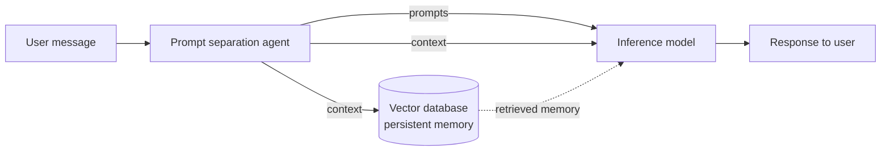

# Prompt-Context-Separator

A pattern, prompt library, and reference dataset for **separating the asks from the surrounding context** in a user message before it hits a downstream LLM.

## The idea

A typical message to an AI mixes two distinct things:

1. **Prompts** — the discrete asks. What the user actually wants answered or done.
2. **Context** — background that grounds the asks but is not itself a question: prior thinking, motivation, references to past work, constraints.

A small **prompt processing agent** sits in front of the main model and splits the input into these two fields. Downstream systems then consume them differently.

## Architecture



The same separated `context` serves two purposes: it is passed to the answering model **and** stored in a vector database so future turns can retrieve it.

## Use cases

This pattern is useful in two distinct situations:

### 1. Better targeted responses

By sharply isolating "what is the user actually asking?" from "what is the surrounding background?", the downstream model spends its attention on the right thing. Long, meandering inputs that get vague answers when sent raw produce sharper answers when the asks are surfaced cleanly. See [`system-prompts/variants/for-targeted-inference.md`](system-prompts/variants/for-targeted-inference.md).

### 2. Persistent memory pipeline

The `context` array is exactly the shape a vector database wants: discrete, self-contained, third-person facts that embed cleanly and retrieve atomically. Running every user message through a separation agent produces a clean stream of memory chunks as a side effect of normal interaction. See [`system-prompts/variants/for-vector-memory.md`](system-prompts/variants/for-vector-memory.md).

The two use cases compose: separated context can simultaneously feed the answering model now and the vector store for later.

## Output schema

The separation agent returns:

```json
{
  "prompts": ["string", "..."],
  "context": ["string", "..."]
}
```

- **`prompts`** — array of self-contained asks. Light cleanup, no paraphrasing.
- **`context`** — array of third-person background chunks, each prefixed `{{user}}`. One discrete idea per chunk.

## Prompt library

Three baseline prompts (same schema, different shot counts):

| File | Description |
|---|---|
| [`system-prompts/zero-shot.md`](system-prompts/zero-shot.md) | No examples — instructions only. |
| [`system-prompts/one-shot.md`](system-prompts/one-shot.md) | One worked example. |
| [`system-prompts/few-shot.md`](system-prompts/few-shot.md) | Three worked examples covering multi-ask, prior-context, and bare-ask cases. |

Use-case variants:

| File | When to use |
|---|---|
| [`system-prompts/variants/for-targeted-inference.md`](system-prompts/variants/for-targeted-inference.md) | Downstream consumer is the answering model. Optimise for response quality. |
| [`system-prompts/variants/for-vector-memory.md`](system-prompts/variants/for-vector-memory.md) | Downstream consumer is a vector DB. Optimise for retrieval quality. |
| [`system-prompts/variants/for-dictation.md`](system-prompts/variants/for-dictation.md) | Input is voice-typed. Strip dictation artefacts and verbal scaffolding. |

The shared output contract lives in [`system-prompts/_schema.md`](system-prompts/_schema.md).

## Reference dataset

`data/gold.csv` and `data/gold.jsonl` contain 10 human-annotated rows pulled from the upstream [`danielrosehill/Prompt-Separation`](https://huggingface.co/datasets/danielrosehill/Prompt-Separation) dataset on Hugging Face — included as canonical examples of correct separation.

The JSONL form collapses the wide `promptN` / `contextN` columns into `prompts` and `context` lists, matching the live agent's output shape.

## Related

- Dataset: <https://huggingface.co/datasets/danielrosehill/Prompt-Separation>
- Upstream pipeline / labelling code: <https://github.com/danielrosehill/MWP-Prompts-0426>

## License

MIT (code and prompts) — gold rows derived from the upstream dataset retain its CC-BY-4.0 license.
